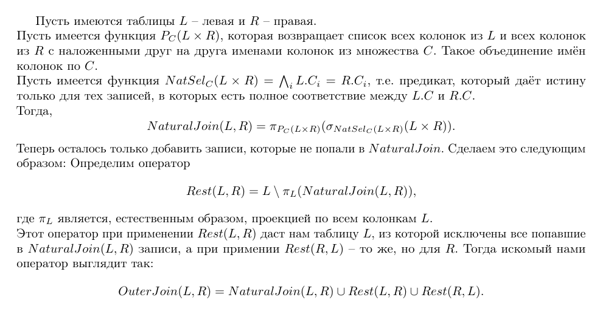

# Практис четвёртый, про SQL и реляционную алгебру

Диалект SQL == SQLite.

### Задание 1
а) Какие фамилии читателей в Москве?

```sql
SELECT LastName FROM Reader
WHERE Address LIKE '%Moscow%'
```

б) Какие книги (author, title) брал Иван Иванов? 

```sql
SELECT Author, Title FROM
    Book B JOIN Borrowing Borr
        ON B.ISBN = Borr.ISBN
           JOIN Reader R
        ON Borr.ReaderNr = R.ID
WHERE R.LastName = 'Иванов' AND R.FirstName = 'Иван'
```

в) Какие книги (ISBN) из категории "Горы" не относятся к категории "Путешествия"? Подкатегории не обязательно принимать во внимание!

```sql
SELECT B.ISBN FROM
	Book B JOIN BookCat BC
    	ON B.ISBN = BC.ISBN
WHERE Bc.CategoryName = 'Горы' AND Bc.CategoryName != 'Путешествия'
```

г) Какие читатели (LastName, FirstName) вернули копию книгу?

```sql
SELECT R.FirstName, R.LastName FROM
	Reader R JOIN Borrowing Br
    	ON Br.ReaderNr = R.ID
WHERE Br.ReturnDate < DATE('now')
```

д) Какие читатели (LastName, FirstName) брали хотя бы одну книгу (не копию), которую брал также Иван Иванов (не включайте Ивана Иванова в результат)?

```sql
SELECT DISTINCT R.FirstName, R.LastName FROM
	Borrowing Br JOIN Reader R
    	ON Br.ReaderNr = R.ID
WHERE Br.ISBN IN (SELECT Br.ISBN FROM
                      Borrowing Br JOIN Reader R
                          ON Br.ReaderNr = R.ID
                  WHERE R.FirstName = 'Иван' AND R.LastName = 'Иванов')
AND (R.FirstName != 'Иван' OR R.LastName != 'Иванов')
```


### Задание 2

а) Найдите все прямые рейсы из Москвы в Тверь. 

```sql
SELECT Tr.TrainNr FROM
	Train Tr JOIN Connection C
    	on Tr.TrainNr = C.TrainNr
WHERE C.FromStation = 'Москва' AND C.ToStation = 'Тверь'
```

б) Найдите все многосегментные маршруты, имеющие точно однодневный трансфер из Москвы в Санкт-Петербург (первое отправление и прибытие в конечную точку должны быть в одну и ту же дату)

```sql
SELECT DISTINCT Tr.TrainNr FROM
Train Tr JOIN
    (SELECT C.TrainNr, C.Departure, C.Arrival FROM
     	Connection C GROUP BY C.TrainNr
     	HAVING COUNT(*) > 1) C
ON Tr.TrainNr = C.TrainNr
WHERE JULIANDAY(C.Departure, '-1 day') = JULIANDAY(C.Arrival)
```

в) Что изменится в выражениях для а) и б), если отношение "Connection" не содержит дополнительных кортежей для транзитивного замыкания, поэтому многосегментный маршрут Москва-> Тверь-> Санкт-Петербург содержит только кортежи Москва-> Тверь и Тверь-Санкт-Петербург?

Думаю, нужно будет джойнить `Connection` на себя.
По типу 
```sql
Connection C1 LEFT OUTER JOIN Connection C2
	ON C1.ToStation = C2.FromStation AND C1.TrainNr = C2.TrainNr
```
(все маршруты длины 2 и 1), и танцевать что-то оттуда.


### Задание 3
OuterJoin в реляционной алгебре

